# Introduction

### CS-104 · Week 1

---

# Monday

---

## We're in this together

> Do nothing out of selfish ambition or vain conceit. Rather, in humility value others above yourselves, not looking to your own interests but each of you to the interests of the others.

Philippians 2:3-4

Serving each other by helping each other learn
<!-- .element: class="fragment" -->

---

# Program

---

## Program

- Programming = writing programs. What are programs?

<div class="columns" style="display:flex; gap:1.5rem; align-items:center;">
<div style="flex:7; text-align:center">

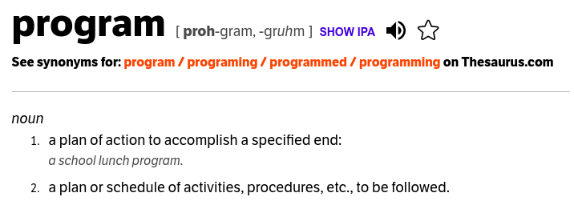

</div>
<div style="flex:3; text-align:center">

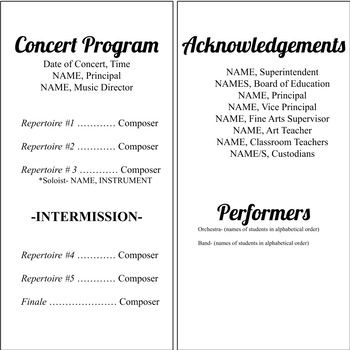

</div>
</div>

---

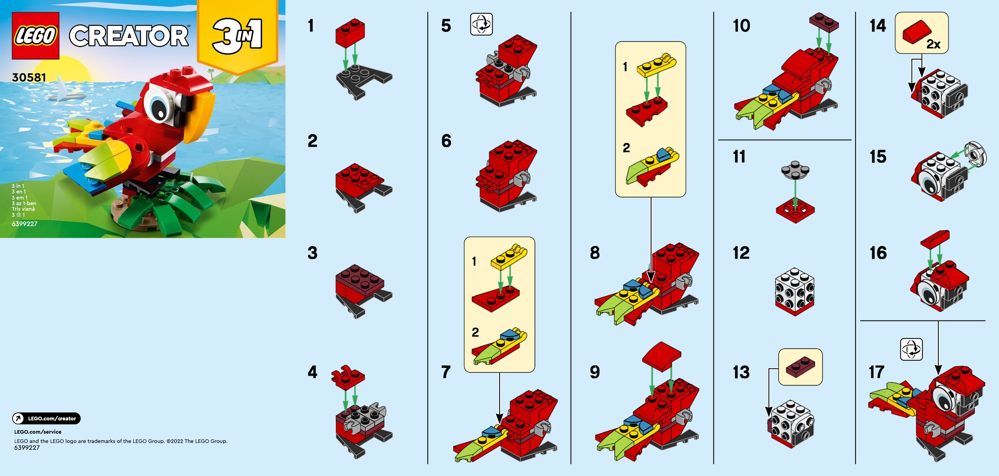

---

## Programs are forms of wisdom

<div class="columns" style="display:flex; gap:1.5rem; align-items:center; justify-content:center;">
<div style="flex:1; text-align:center">

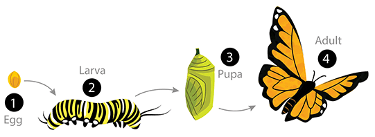

</div>
<div style="flex:1; text-align:center">

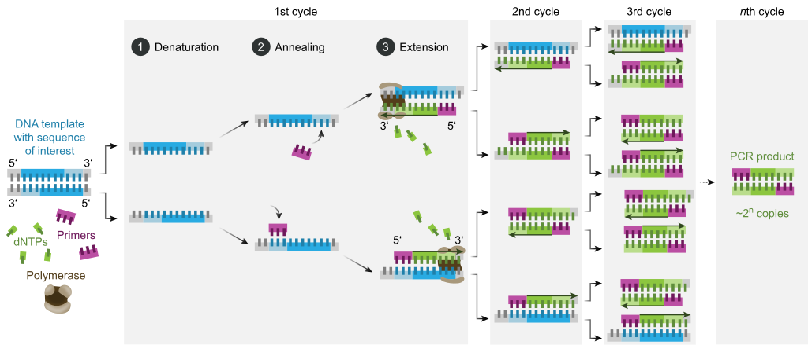

</div>
</div>

---

## Programs are forms of wisdom

> 22 "The Lord brought me forth as the first of his works, before his deeds of old; 23 I was formed long ages ago, at the very beginning, when the world came to be. 24 When there were no watery depths, I was given birth, when there were no springs overflowing with water; 25 before the mountains were settled in place, before the hills, I was given birth, 26 before he made the world or its fields or any of the dust of the earth. 27 I was there when he set the heavens in place, when he marked out the horizon on the face of the deep, 28 when he established the clouds above and fixed securely the fountains of the deep, 29 when he gave the sea its boundary so the waters would not overstep his command, and when he marked out the foundations of the earth. 30 Then I was constantly at his side. I was filled with delight day after day, rejoicing always in his presence, 31 rejoicing in his whole world and delighting in mankind.

---

## Drawing as a program

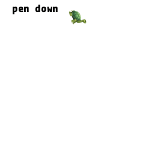

---

# Computation

---

## Computation

- We use programs to **compute** numbers.

<div class="columns" style="display:flex; gap:1.5rem;">
<div style="flex:1; text-align:center">

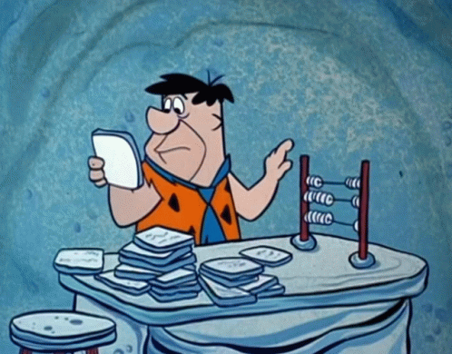

</div>
<div style="flex:1; text-align:center">

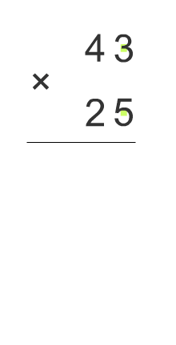

</div>
<div style="flex:1; text-align:center">


</div>
</div>

---

## Automatic computation

- Charles Babbage is known for developing the first automatic computer machine (1820s)
  - "the faster and more reliably one could calculate, the more money businesses could make."

<div class="columns" style="display:flex; gap:1.5rem; align-items:center;">
<div style="flex:7; text-align:center">

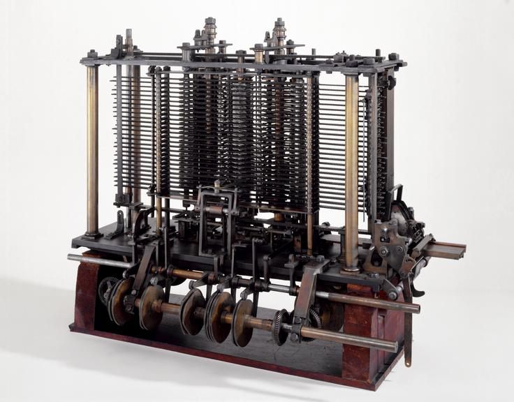

</div>
<div style="flex:3; text-align:center">

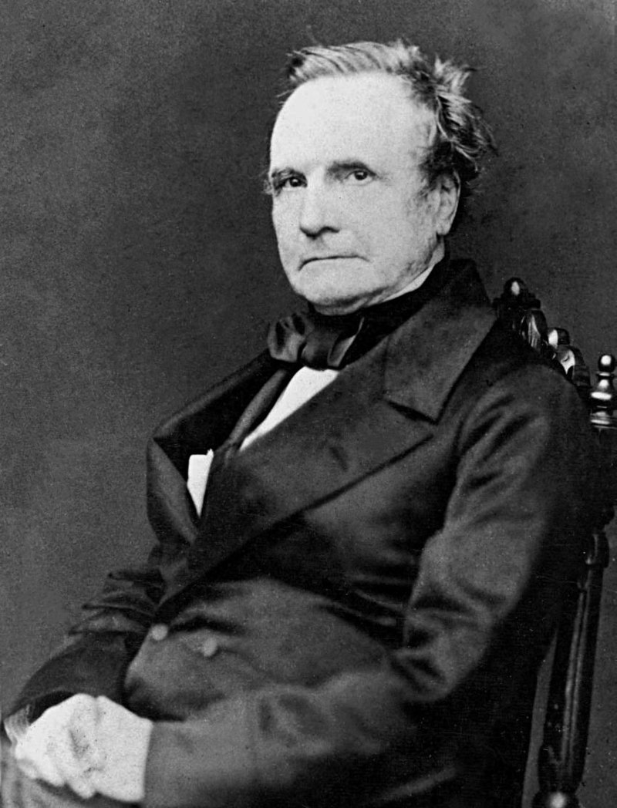

</div>
</div>

---

## Ada Lovelace's program

- Ada Lovelace, daughter of Lord Byron, became enamoured by Babbage's machine and developed the first **algorithm**, to calculate a sum of numbers:

<div class="columns" style="display:flex; gap:1.5rem; align-items:center;">
<div style="flex:7; text-align:center">

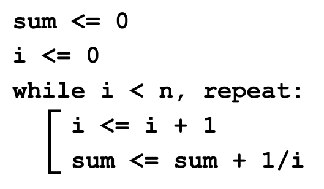

</div>
<div style="flex:3; text-align:center">


</div>
</div>

---

## Algorithm

- Basically, a program: a description of a series of operations.
- But with some specific features:
  1. Precise and unambiguous steps
  2. Definite results
  3. Finite
  4. Generalizable (works with a range of possible inputs)
  5. Usually expressed through abstract/mathematical notation

---

## STEM today is programming computations

- For complex calculations, we don't rely anymore on pressing calculator buttons. We have to program!

[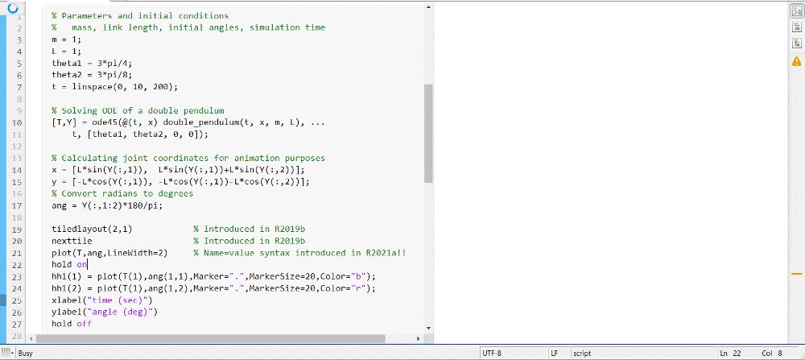](https://blogs.mathworks.com/pick/2021/03/26/animation-playback-controls-in-live-scripts-r2021a/)

---

# Code

---

## Code

- Initially, computer operators had to set the program manually to run...

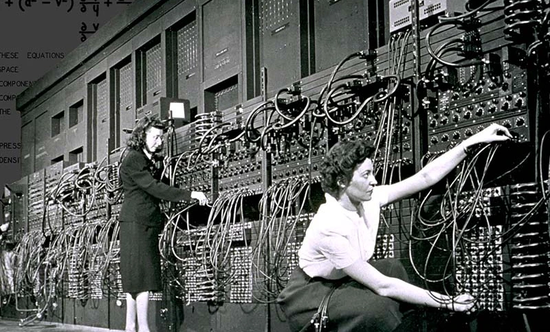

---

## The punched card

- At the end of the 1800s, Herman Hollerith invented the punched card, to be automatically read by a machine.
- Instructions were then **CODED** in the punched card.

<div class="columns" style="display:flex; gap:1.5rem; align-items:center;">
<div style="flex:6; text-align:center">

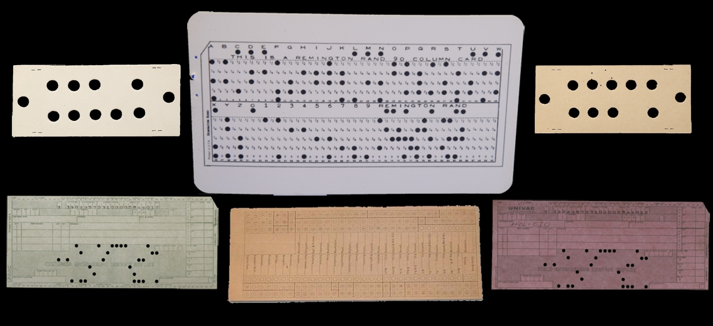

</div>
<div style="flex:4; text-align:center">

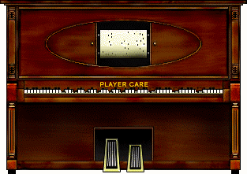

</div>
</div>

---

## Grace Hopper's proposal

- Later, in 1949, Grace Hopper invented the first programming language: COBOL (COmmon Business-Oriented Language)
  - For example, the user would write:

    `COMPUTE SUM = (1 + 3)`

    `DIVIDE SUM BY 2 GIVING AVERAGE`
- Crucial to this was the development of the **compiler**: a program capable of converting a sentence very much like an English phrase (with syntax and semantics) into machine instructions.

---

## So, what's a code?

- "A program that follows a set of rules" (in order to be correctly interpreted)
- To learn how to program, then, is to learn **how to express yourself correctly through the code**
  - Notice the origin of the word - [codex](https://www.britannica.com/topic/codex-manuscript)

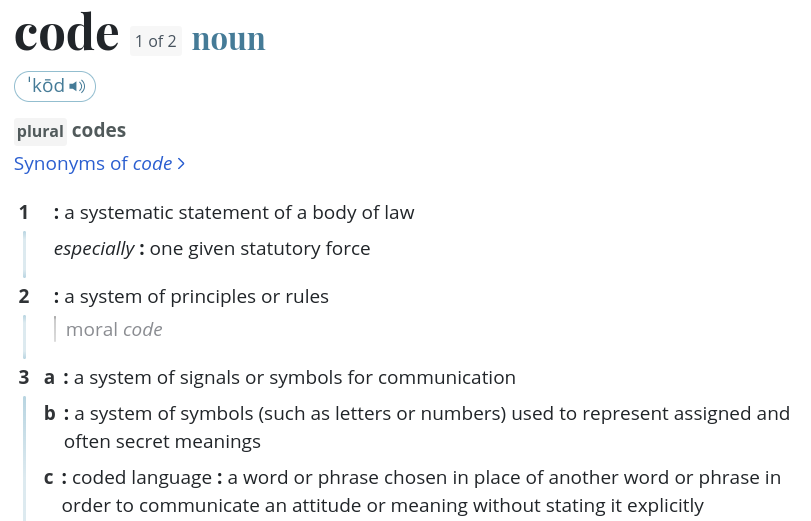

---

## Python programming language

- Invented in the early 1990s by Guido van Rossum, named after Monty Python's Flying Circus
- Open source project
- High-level, general-purpose language
- Widely available, easy to learn, rich in tools and libraries, and portable

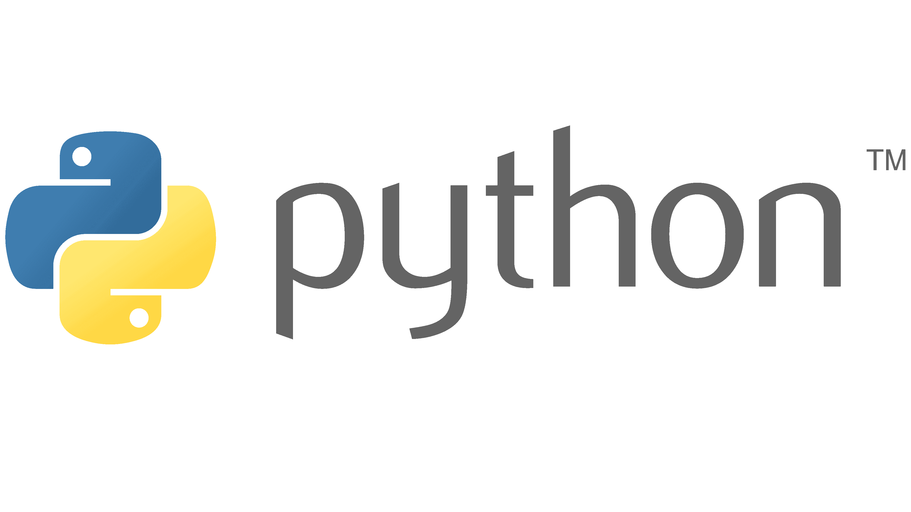

---

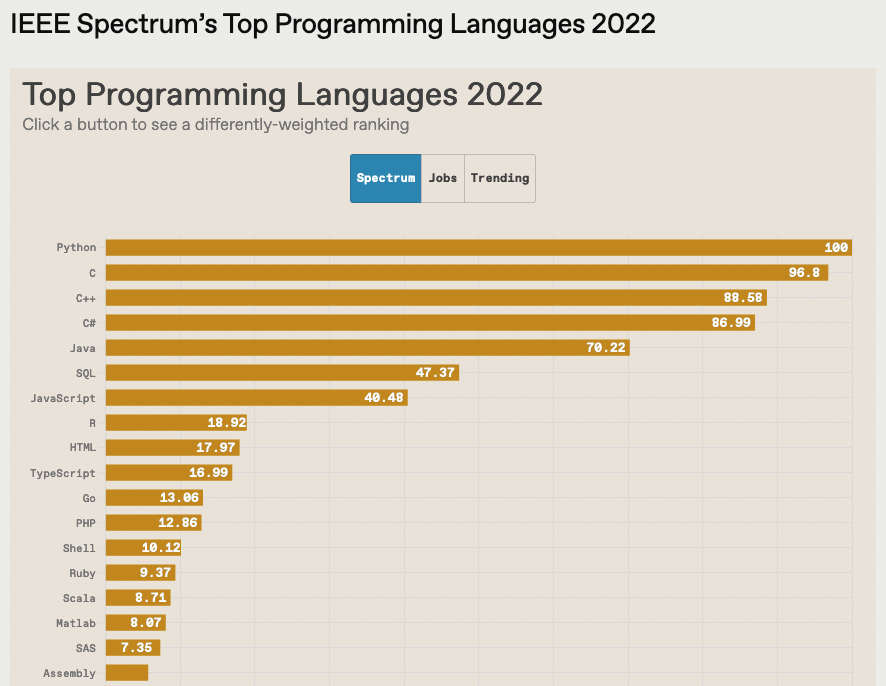

*[Source: IEEE Spectrum, Top Programming Languages 2022](https://spectrum.ieee.org/top-programming-languages-2022)*

---

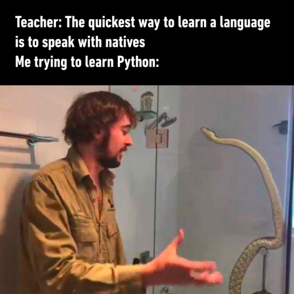

---

# Why learn programming if AI can do this for me?

---

## The honest answer

AI narrows the gap for some tasks.
It widens it for others.

Which one happens to *you* depends on how you use it —
not on whether you use it.

---

## Exhibit A: AI can narrow the gap

Consultants using GPT-4 on realistic BCG tasks:

- Below-average performers: **+43%** on quality
- Above-average performers: **+17%** on quality

AI acted as a compensatory tool — it filled in what
weaker performers didn't already know.

*Dell'Acqua et al., "Navigating the Jagged Technological Frontier,"
Organization Science (2026) — [SSRN](https://papers.ssrn.com/sol3/papers.cfm?abstract_id=4573321) · [DOI](https://doi.org/10.1287/orsc.2025.21838)*

---

## Exhibit B: AI can widen the gap

Novice programmers using GitHub Copilot on a CS1 problem:

- Students already showing confusion accepted
  **34.1%** of Copilot's suggestions
- Students who weren't confused accepted **24.5%**

The struggling students leaned on AI *more* —
and ended up with code they couldn't explain.

*Prather et al., "The Widening Gap," ICER (2024) —
[arXiv:2405.17739](https://arxiv.org/abs/2405.17739)*

---

## Same tool. Opposite outcome. Why?

**Consulting task:** the answer is the deliverable.
Getting a good answer *is* the win.

**Learning to program:** the answer is not the point.
The skill you build while getting there is.

Copying a correct answer skips the part
you're actually here to build.

---

## What the research says predicts the outcome

Not raw talent. Not how "smart" you are on day one.

**Metacognitive regulation** — whether you:

- notice when you don't understand something
- check AI output instead of trusting it
- can explain *why* your code works

---

## So why learn to program?

Because the parts of programming that AI
makes fast — syntax, boilerplate, lookup —
were never the hard part.

The hard part — knowing *what* to build,
*why* it's wrong, and *how* to fix it —
is exactly what you're here to practice.

AI can write the code.
It can't do the understanding for you.

### Sources

- Dell'Acqua, F. et al. (2026). *Navigating the Jagged Technological
  Frontier.* Organization Science.
  [papers.ssrn.com/sol3/papers.cfm?abstract_id=4573321](https://papers.ssrn.com/sol3/papers.cfm?abstract_id=4573321)
- Prather, J. et al. (2024). *The Widening Gap: The Benefits and
  Harms of Generative AI for Novice Programmers.* ICER.
  [arxiv.org/abs/2405.17739](https://arxiv.org/abs/2405.17739)
- Adejumo, A. A. et al. (2026). *A systematic review of the impact
  of GenAI on learning performance... in computer science education.*
  Computers and Education: AI.
  [doi.org/10.1016/j.caeai.2026.100570](https://doi.org/10.1016/j.caeai.2026.100570)

---

# Objects

---

## Objects

- Python syntax specifies some ways to represent different types of data. A data representation in Python is called an "object".

| Type | Object type in Python | Example |
|---|---|---|
| Integer number | `int` | `123` |
| Decimal number (floating point) | `float` | `3.14` |
| Logic value | `bool` | `True`, `False` |
| Text | `string` | `"Hello World!"` |

---

# Variables

---

## Variables

- Variables are names we set to refer to objects.
  - A not-so-good metaphor: variables are containers for objects
  - A better metaphor: objects are houses, variables are addresses of these houses

```python
x = 123  # a variable x that contains the integer value 123
x = x + 1  # x is updated with the value of x + 1, becoming 124...
hello = "Hello World!"  # a variable that contains the string "Hello World!"
is_done = True  # a variable is_done with the logic value True
```

---

## Assigning objects to variables

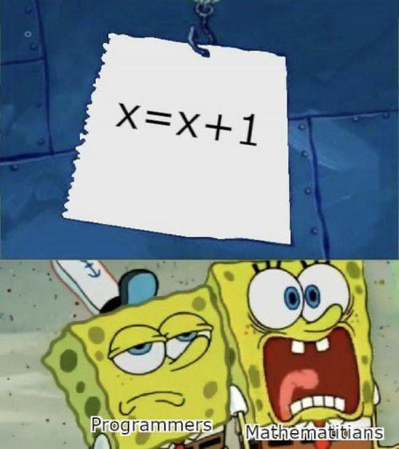

---

## Objects x variables

- It is **very important** to differentiate!
- Which of the following are variables and which are objects?

```
"hello"

hello

132

var_1

truev

True
```

---

## Variable naming conventions in Python

- They MUST start with a letter or with _ (underline)
- They are case sensitive ('C' is different from 'c')
- They can't contain: `{ ( + - * / \ ; . , ?`
- They can't have names of words already reserved for other purposes in Python:

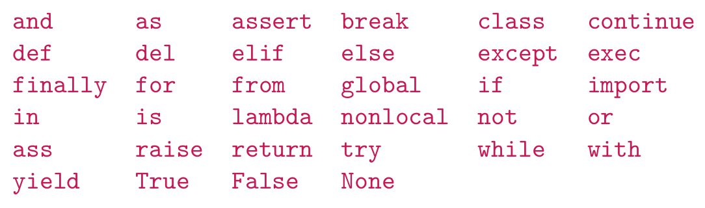

---

What happens if?

```python
True = 123
```

```python
"Hello" = world
```

```python
1stcar = 2000
```

---

# Input/Output

---

## Input/Output

- Programming is nothing without the design of an **interface**!
  - I have to be able to **input** data in the program, and
  - I have to be able to get results (**output**) from the program.


---

## Graphical user interface (GUI)

- Kind of mimics the way we use mechanical input and output
- Traditionally, [WIMP](https://www.interaction-design.org/literature/book/the-glossary-of-human-computer-interaction/wimp) (Windows, Icons, Menus and Pointers)

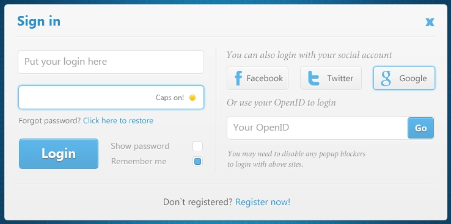

---

## Text input/output

- Even simpler, however, it is a good start for programming!

```python
name = input("Please enter your name:")
reverse = name[::-1]
print("Your name in reverse is", reverse)
```

The command-line interface will ask for input from our keyboard, and then:

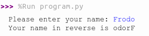

---

## Python text output: `print()`

- Put what you want to print between the parentheses: `print("Hello World")`
- If you want to jump to a new line, use `\n`: `print("Hello\nWorld")`
- You can also pass multiple arguments by separating them with commas: `print("x has the value:", x, "\nand y has the value:", y)`

---

## Python text input: `input()`

- The command waits until the user types some text in the command-line interface and finishes with ENTER
- The term `input()` "turns" into the text entered, and is **ALWAYS** an object the type `string`!
- Thus, it needs to be saved into a variable: `x = input()`
  - After the user types "Hi", for example, it is as if: `x = "Hi"`
- You can customize an input message by passing a string:

```python
x = input("Please enter your name: ")
```

---

## Input of numeric values

- Now, suppose we want to calculate the sum of two numbers:

```python
x = input("Please enter first number: ")
y = input("Please enter second number: ")
z = x + y
print("The sum is", z)
```

What happened???

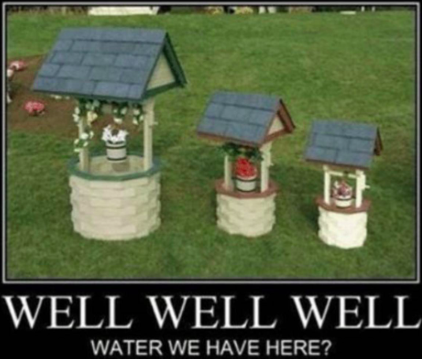

- We were adding two strings together, not two numbers! (`input()` gives strings!)

---

## Converting string to number types

- You can convert a string to a number using the methods `int()` and `float()`
  - The string that goes inside the parentheses (which we call the "argument" of the method) will be turned to an integer/float

```python
xstring = input("Please enter your age: ")
x = int(xstring)
print("Your age is ", x)
```

- Just make things shorter by chaining one method into another!

```python
x = int(input("Please enter your age: "))
print("Your age is ", x)
```

---

# Running code

---

## Running code

Try:

- Saving some previous code as `program.py`
- Open a command-line interface in your computer and run: `python3 program.py`
  - You need to have python3 installed in your machine
  - You need to be in the directory of the file `program.py`

---

Python can be run in two modes:

<div class="columns" style="display:flex; gap:2rem;">
<div style="flex:1">

### Script / Program

- All lines of code executed without stop
- Run in command-line as `python3 program.py`
- Only print what is specifically passed through `print()`

</div>
<div style="flex:1">

### Interactive shell

- Run lines of code each at a time, as user enters them
- Open in command-line just by typing `python3`
- Typing an expression without being assigned to a variable will "print" the result

</div>
</div>

---

## Integrated Development Environment (IDE)

- In our classes, we will be using [Thonny](https://thonny.org/)
  - Notice the panels for scripting and for interactive shell
  - There is also a helper and variable explorer for debugging code

---

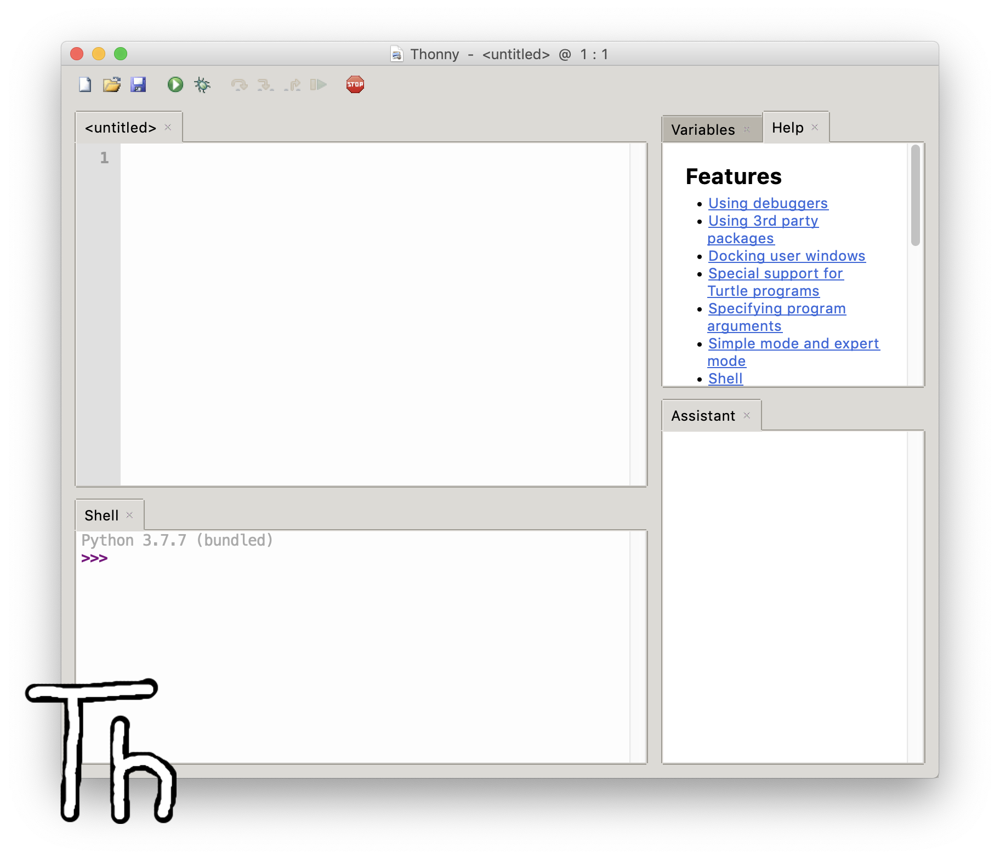

---

## Exercise 1.a.1

Form teams of two. The 1st student, the *explainer*, explains how to draw an image. The explainer:

- knows what the image is supposed to be.
- may not use their hands.
- may only specify actions the drawer knows how to perform.

The 2nd student, the *drawer*, draws the image as specified. The drawer:

- doesn't know what the image is supposed to be.
- can follow directions like:
  - **go forward** 10 units
  - **turn right** 90 degrees
  - **pick your pen up** and **put your pen down**
- can't remember anything.

Sample images to draw:

<div class="columns" style="display:flex; gap:1.5rem; align-items:flex-end;">
<div style="flex:1; text-align:center">

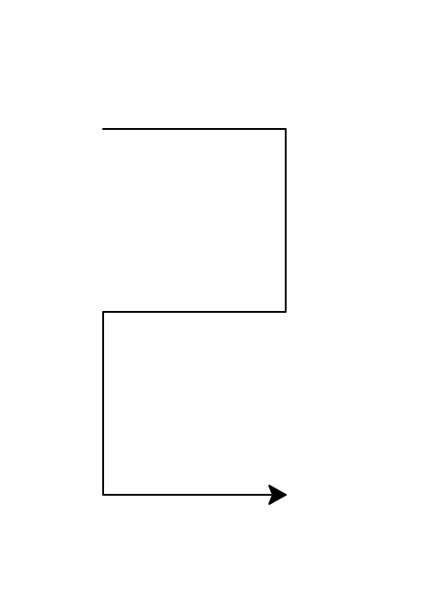

2

</div>
<div style="flex:1; text-align:center">

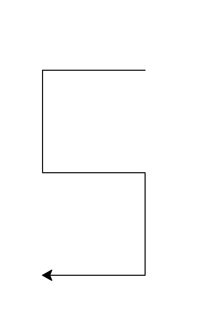

5

</div>
<div style="flex:1; text-align:center">


face *(optional, more complex)*

</div>
<div style="flex:1; text-align:center">


tic-tac-toe *(optional, more complex)*

</div>
</div>

Note:
Example images (from the explainer/drawer exercise):

- [2](https://cs.calvin.edu/courses/cs/106/cur/01introduction/images/2.png)
- [5](https://cs.calvin.edu/courses/cs/106/cur/01introduction/images/5.png)
- face and tic-tac-toe are optional, more complicated alternates.

---

## Additional Reference Images

*Pulled in from related Week 1 lab/homework materials for this unit — shown here for reference, not part of the original slide content.*

<div class="columns" style="display:flex; gap:1.5rem; flex-wrap:wrap;">
<div style="flex:1; min-width:120px; text-align:center">

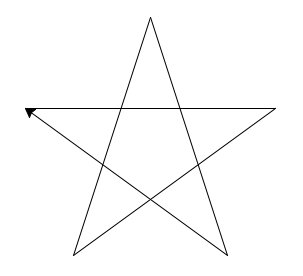

Turtle Star (Lab 1.2)

</div>
<div style="flex:1; min-width:120px; text-align:center">

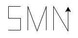

Homework: initials

</div>
<div style="flex:1; min-width:120px; text-align:center">

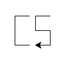

Older lab example

</div>
<div style="flex:1; min-width:120px; text-align:center">

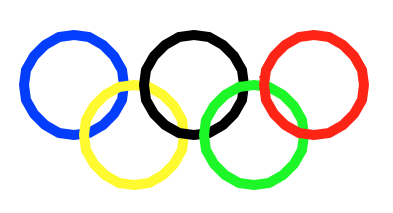

Older homework example

</div>
<div style="flex:1; min-width:120px; text-align:center">

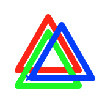

Older homework example

</div>
<div style="flex:1; min-width:120px; text-align:center">

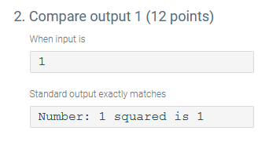

zyLabs I/O test screenshot

</div>
</div>

---

## Exercise 1.a.2

Explain what the following *algorithm* does.

> 1. **Given:** two positive natural numbers *a* & *b*
> 2. **Set** *remainder* = some non-zero value
> 3. **Repeat** these steps **until** *remainder* = 0
>     1. **Set** *remainder* = the remainder of *a* divided by *b*
>     2. **If** *remainder* = 0 **Then**
>         1. **Print** GCD is *b*
>     3. **Else**
>         1. **Set** *a* = *b* and *b* = *remainder*
>     4. **Go on to** the next repetition
> 4. **Test Cases:** GCD(36,16)→4; GCD(1,1)→1; GCD(1260,198)→18

---

## Exercise 1.a.3

Form groups and use a stack of index cards according to these rules:

- Write the first name of each person in the group on a separate card.
- The cards start in a row, side-by-side, face down on the table.
- The person moving the cards can only have one card in each hand at any point (i.e. they can only look at the values of two cards).
- The instructions cannot require the person to remember the value of a card they've put down; such values must be written down.
- The algorithm can use the space on the table in any manner.

Write algorithms to do the following.

1. *Count* — Count the number of cards.
2. *Search* — Find a card by name.
3. *Sort* — Reorder the set of cards in alphabetical order.

---

# Friday

---

## Lab Recap

- On your own, write the solution to the "square area" problem without looking at what you did in lab.
- Compare your solution with people around you. Try to find someone who took a different approach!
- Discuss with each other
  - What challenges you faced in lab
  - What you're curious about or tried on your own
  - How you felt about the lab, and this class so far

---

## Process-Oriented Guided Inquiry Learning (POGIL)

### [What](https://cspogil.org/What%2Bis%2BPOGIL)

- based on research on how people learn most effectively
- **team activities** to construct understanding of key concepts
- develop process skills: **communication**, **critical thinking**, **problem solving**
- The instructor is not a lecturer, but an active facilitator of student learning

### How

Form teams of three:

- a *programmer* (runs the exercises in [Thonny](https://thonny.org/))
- a *recorder* (writes the team's answers to the exercises)
- a *manager/presenter* (keeps the team on track; interacts with class)

---

## POGIL

Form teams of three:

- a *programmer* (runs the exercises in [Thonny](https://thonny.org/))
- a *recorder* (writes the team's answers to the exercises)
- a *manager/presenter* (keeps the team on track; interacts with class)

*Activities for CS1 in Python*, [Introduction to Python](https://cs.calvin.edu/courses/cs/106/cur/resources/pogil/Act01-IntroPython_Student.pdf):

1. *Model 1*. Getting Started with Thonny
2. *Model 2*. Python Build-In Functions
3. *Model 3*. Variables and Assignment

These exercises are available as [editable PDFs](https://cs.calvin.edu/courses/cs/106/cur/resources/pogil). If editing doesn't work for you, try a different browser or PDF viewer.

---

## Sabbath

> Observe the Sabbath day, to keep it holy, as the LORD your God commanded you. Six days you shall labor and do all your work, but the seventh day is a Sabbath to the LORD your God. On it you shall not do any work, you or your son or your daughter or your male servant or your female servant, or your ox or your donkey or any of your livestock, or the sojourner who is within your gates, that your male servant and your female servant may rest as well as you.
>
> **You shall remember that you were a slave in the land of Egypt, and the LORD your God brought you out from there** with a mighty hand and an outstretched arm. Therefore the LORD your God commanded you to keep the Sabbath day. (*Deut 5:12*)

---

## Traits

What are the traits that you think make for a good computer scientist?

