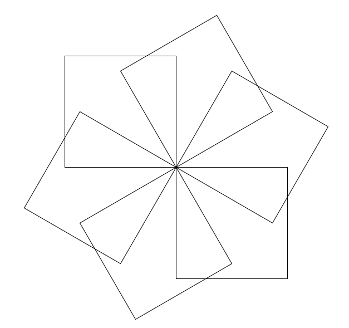
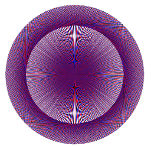
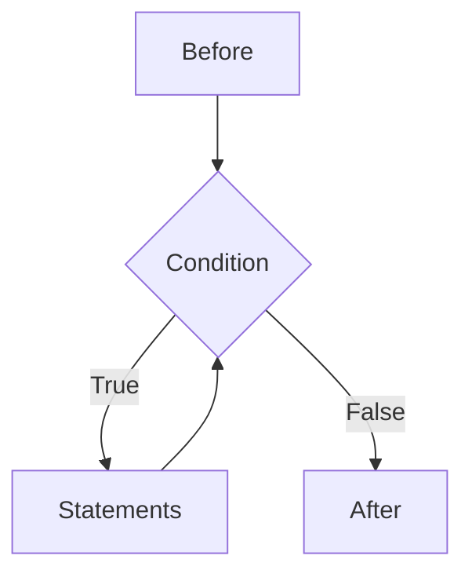

# Loops

### CS-104 · Week 5

---

# Graphical Examples

---

## Exercise 1: Star

Write a turtle program that draws a 5-pointed star. Use a loop.

Turtle template code:

```python
import random
import turtle

window = turtle.Screen()
window.bgcolor('black')
pen = turtle.Turtle()
pen.color('white')
```

---

## Exercise 2: Colored Star

Write a turtle program that draws a 5-pointed star. Loop over the following list of colors for the sides: `['red', 'green', 'purple', 'blue', 'yellow']`

> **Tip:** Use a wider pen so it's easier to see:
>
> ```python
> pen.width(10)
> ```

---

## Exercise 3: Starfield

Write a turtle program that draws 50 5-pointed stars at random positions on the screen.

Use the following code to get positions:

```python
x = random.uniform(-200, 200)
y = random.uniform(-150, 150)
pen.goto(x, y)
```

> **Tip:** Add `pen.speed('fastest')` before your loop to speed up the drawing.

---

## Exercise 4: Gradually moving outward

1. Start a variable called `distance` at 0.
2. Do the following 500 times:
    1. move forward by `distance`
    2. turn right 90 degrees
    3. increase `distance` by 2

Refinement: Instead of "Do the following 500 times", do the following as long as `pen.distance(0, 0)` is less than 500.

---

## Exercise 5: Gradually coloring outward

1. Start a variable called `length` at 0.
2. Do the following as long as `pen.distance(0, 0)` is less than 500:
    1. for each color in a list of colors:
        1. set the pen color to that color
        2. move forward by `length`
        3. turn right some amount
        4. increase `length` by 1

---

## Exercise 6: Rotated Squares

<div class="columns" style="display:flex; gap:2rem;">
<div style="flex:1">

1. Draw n=6 rotated squares. (turn 360/n degrees between each.)
2. Now try n=50.
3. Same, but use a different color for each square. Cycle the colors.

Example:
colors = ['red', 'black', 'blue']

</div>
<div style="flex:1">





</div>
</div>

---

# `while` loops

---

## `while` loops

*Definition*

A while loop executes a statement based on a boolean condition.

<div class="columns" style="display:flex; gap:2rem;">
<div style="flex:1">

```python
# Before
while condition:
    statements
# After
```

</div>
<div style="flex:1">



</div>
</div>

Analogy: *while* there are dishes in the sink, wash another dish.

---

## Example

*Example*

```python
x = int(input("Enter a positive number: "))
while x <= 0:
	print("Try again")
	x = int(input("Enter a positive number: "))

print("Good job!")
```

---

## Exercise

*Exercise*

What will this output?

```python
x = 6
while x > 4:
	  print(x, end=' ')
	  x = x - 1
```

- 6 5
- 6 5 4
- 6 5 4 3
- 5 4 3

---

## A Very Welcoming Program

*Example*

```python
name = input("What is your name? ")
while True:
    print("Hello, " + name + "!")
```

To get out of this infinite loop, press `Ctrl+C` in the Shell, or press the stop button in the toolbar.
<!-- .element: class="fragment" -->

---

## Which number will stop the loop?

*Exercise*

```python
valid = False
while not valid: 
	x = int(input("Enter a number: "))
	valid = (x%2 == 1 and x%3 == 0) 
```

- 2
- 6
- 9
- None of the above

---

## Terminology

*Definition*

- **Loop body**: The statements that are executed each time through the loop.
- **Loop condition**: The boolean expression that determines whether the loop body should be executed again.
- **Loop variable**: A variable that changes each time through the loop.
  - Often used to control the loop condition.

---

## Mid-loop test

*Definition*

In an otherwise infinite loop, use `break` to exit:

```
while True:
    statemets
    if condition:
        break
    more_statements
```

Either of the statements blocks may be empty.

Note: if there are no statements before the `if`, then you can just use `while not condition` instead.

---

## Converting to a mid-loop test

*Example*

Before:

```python
valid = False
while not valid: 
	x = int(input("Enter a number: "))
	valid = (x%2 == 1 and x%3 == 0) 
```

After:

```python
while True:
    x = int(input("Enter a number: "))
    if x%2 == 1 and x%3 == 0:
        break
```

---

## Another example

*Exercise*

How would you convert this to a mid-loop test?

```python
x = int(input("Enter a positive number: "))
while x <= 0:
    print("Try again")
    x = int(input("Enter a positive number: "))

print("Good job!")
```

Solution:
<!-- .element: class="fragment" -->

```python
while True:
    x = int(input("Enter a positive number: "))
    if x > 0:
        break
    print("Try again")

print("Good job!")
```
<!-- .element: class="fragment" -->

We don't have to repeat the `input` statement.
<!-- .element: class="fragment" -->

---

# `for` loops

---

## `for` loops

*Definition*

```python
for variable in sequence:
    statements
```

A Python `for` loop iterates over a sequence of values:

- `str`: each character
- `list`, `tuple`, `set`: each element
- `range`: each number
- `dict`: each key

---

## What is a good description?

*Exercise*

```python
s = input("Please enter a string:")
new_s = ''
for c in s:
    new_s = c + new_s
```

- `new_s` is a copy of `s`
- `new_s` is the reverse of `s`
- `new_s` is the final character of `s`
- `new_s` is the first character of `s`

---

## What is a good description?

*Exercise*

```python
s = input("Please enter a string: ")
new_s = ''
for char in s:
    if char != ' ':
        new_s = new_s + char
print(new_s)
```

- `new_s` is a copy of `s`
- `new_s` is the spaces of `s`
- `new_s` is `s` with no spaces
- `new_s` is `s` with spaces between every character

---

# `range` function

---

## `range` function

*Definition*

```python
range(start, stop, step)
range(start, stop) # step=1
range(stop) # start=0, step=1
```

- `start`: first number
- `stop`: up to but not including ("stop before")
- `step`: increment

Often used with `for` loops.

---

## What values will `idx` take?

*Exercise*

- `for idx in range(7):`
- `for idx in range(1, 7):`
- `for idx in range(0, 7, 2):`
- `for idx in range(13, 10, -1):`

---

## Which will add numbers between 1 and 4?

*Exercise*

<div class="columns" style="display:flex; gap:2rem;">
<div style="flex:1">

A:

```python
for i in range(1,5):
	sum = 0
	sum = sum + i
```

B:

```python
sum = 0
for i in range(1,5):
	sum = sum + sum
```

</div>
<div style="flex:1">

C:

```python
sum = 0
for i in range(1,5):
	sum = sum + 1
```

D:

```python
sum = 0
for i in range(1,5):
	sum = sum + i
```

</div>
</div>

---

## Iterating by index vs value

*Definition*

By value:

```python
s = 'Hi!'
for c in s:
    print(c)
```

By index:

```python
s = 'Hi!'
length = len(s)
for i in range(length):
    c = s[i]
    print(c)
```

---

## Print each character in a string

*Exercise*

Convert this code to use a `for` loop:

```python
idx = 0
while idx < len(a_str):
    print(a_str[idx])
    idx += 1
```

---

# The Accumulator Pattern

---

## The Accumulator Pattern

*Definition*

- **Accumulator**: A variable that is incrementally updated to compute a final result.
- **Initialize** step: Set the accumulator to an initial value: what the result should be if there are no items to process.
- **Update** step: Change the accumulator based on each item in a sequence.
- **Accumulator pattern**:

```python
accumulator = initial_value  # Initialize
for item in sequence: # or while loop
    if condition:  # optional
        accumulator = new_value  # Update
```

---

## Example: Sum of numbers 1 through 5

*Example*

- Accumulator: `total`
- Initialize: `total = 0`
- Update: `total = total + i` for each number `i` from 1 to 5
<!-- .element: class="fragment" -->

```python
total = 0  # Initialize
for i in range(1, 6):  # 1, 2, 3, 4, 5
    total = total + i  # Update
print(total)  # 15
```
<!-- .element: class="fragment" -->

---

## Count how many `a` chars in string `s`

*Example*

- Accumulator: `count`
- Initialize: `count = 0`
- Update: `count = count + 1` if character is 'a'
<!-- .element: class="fragment" -->

```python
count = 0  # Initialize
for c in s:
    if c == 'a':  # Condition
        count = count + 1  # Update
print(count)
```
<!-- .element: class="fragment" -->

---

## Find largest number in a list `numbers`

*Example*

- Accumulator: `largest`
- Initialize: `largest = None` (no largest yet)
- Update: if current number `n` is larger than `largest`, set `largest = n`
<!-- .element: class="fragment" -->

```python
largest = None  # Initialize
for n in numbers:
    if largest is None or n > largest:  # Condition
        largest = n  # Update
print(largest)
```
<!-- .element: class="fragment" -->

---

## Summary

Two different kinds of loops:

- `while` loop: repeat while a condition is true
- `for` loop: repeat for each item in a sequence

`for` loops can iterate over two different kinds of sequences:

- `str`, `list`, `tuple`, `set`, `dict`: containers
- `range`: numbers

**Accumulator pattern**: initialize an accumulator variable, then update it in a loop.
